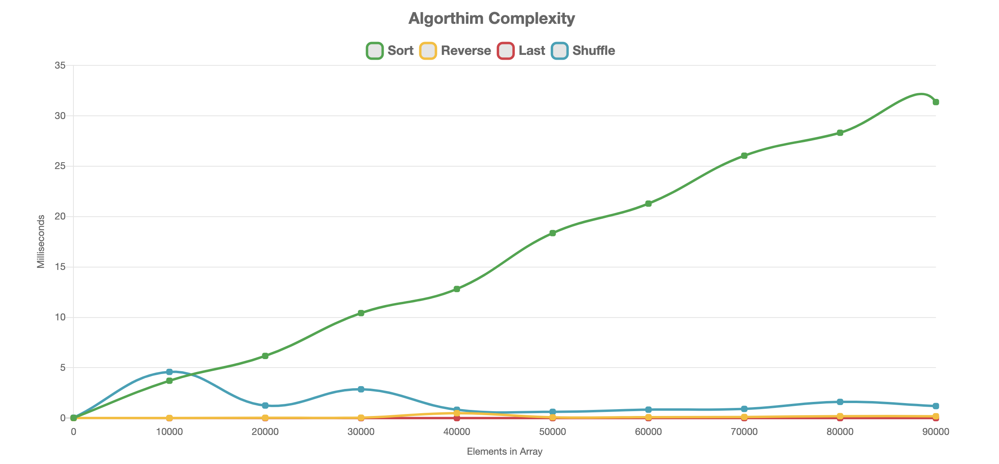
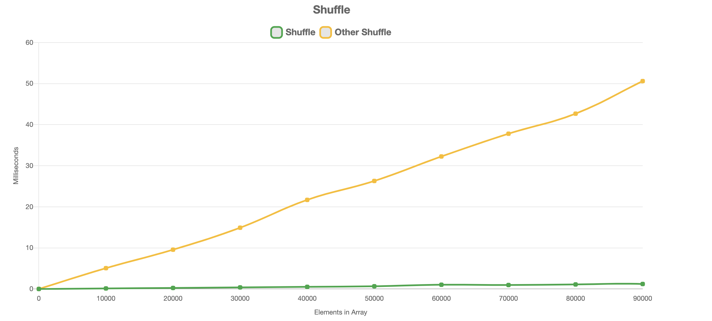
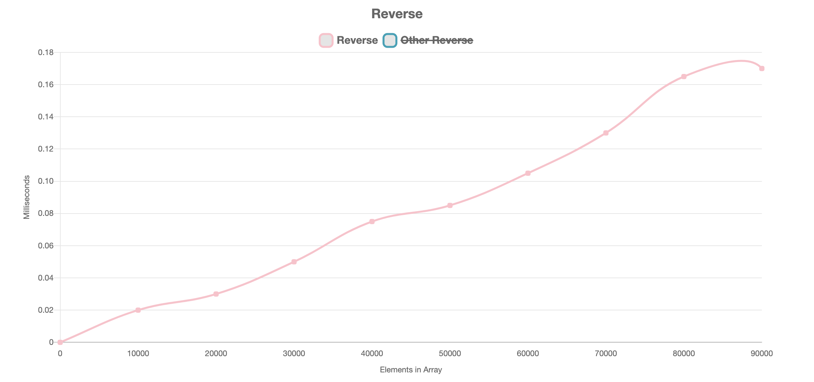
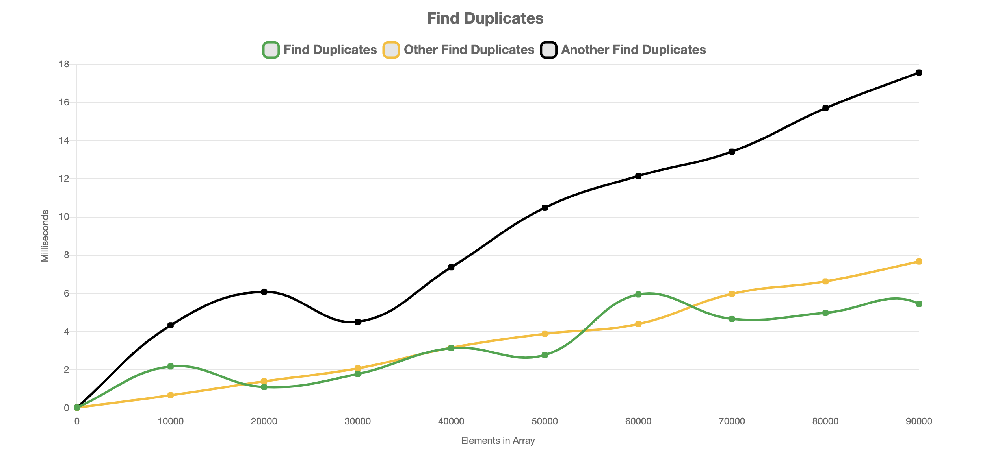
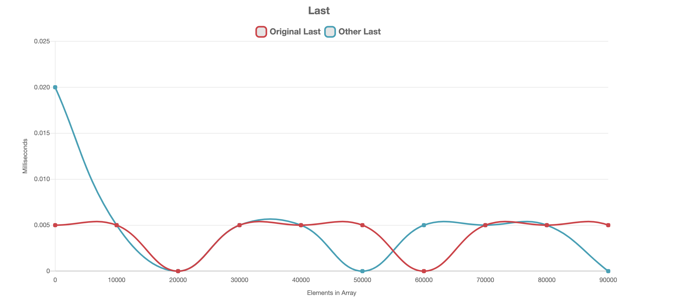
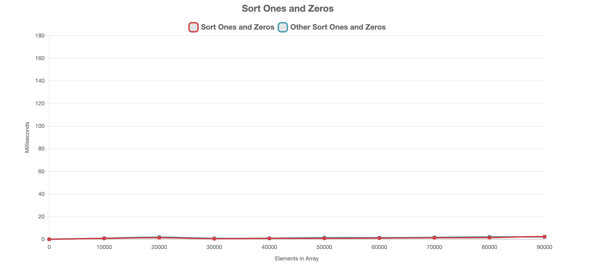
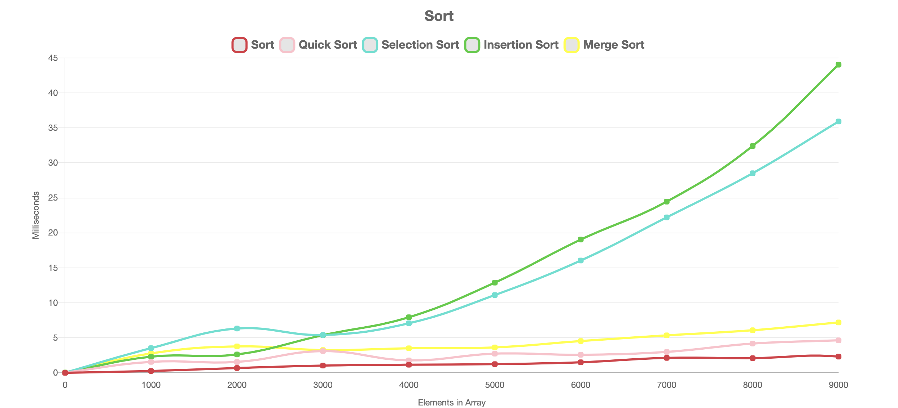
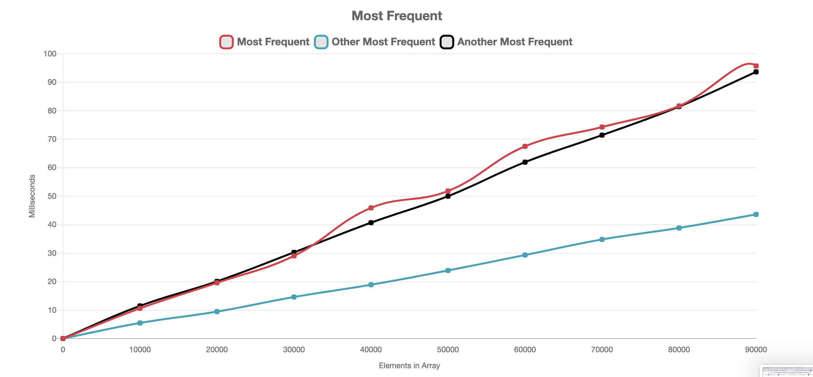
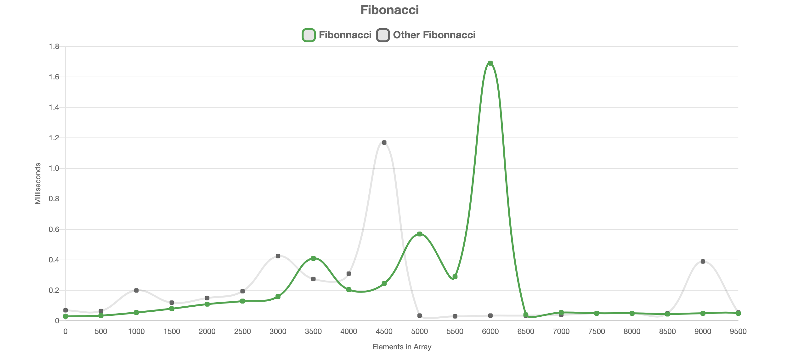

# Algorithmic-Complexity

Timing different algorithms, seeing how they interact with memory and using it to make them faster. Timing function written in JavaScript to time how efficient different algorithms are, including those built in to JavaScript and ones I have written myself using different techniques and data structures.

The graphs demonstrating the algorithms complexity are created using Chart.js and demonstrate how the algorithms perform when given different input sizes.

### How to Run

Clone this repo and navigate into the Jasmine Library. Find the `index.html`, right click and `copy path` and open in the browser of your choice and this will show different graphs illustrating how quickly algorithms run.

### How to run tests

Navigate into the Jasmine Library. Find the `SpecRunner.html`, right click and `copy path` and open in the browser of your choice.

## Comparison Graph For Built in Functions

## Graphs For Own Algorithms

<table>

  <tr>
     <td>Shuffle()</td>
      <td>Reverse()</td>
  </tr>
  <tr>
    <td valign="top"></td>
    <td valign="top"></td>
  </tr>
 </table>

 <table>
  <tr>
     <td>Find Duplicates()</td>
      <td>Last()</td>
  </tr>
  <tr>
    <td valign="top"></td>
    <td valign="top"></td>
  </tr>
 </table>

 <table>
  <tr>
     <td>Sort Zeros and Ones()</td>
      <td>Sort()</td>
  </tr>
  <tr>
    <td valign="top"></td>
    <td valign="top"></td>
  </tr>
 </table>

 <table>
  <tr>
     <td>Most Frequent()</td>
      <td>Fibonacci()</td>
  </tr>
  <tr>
    <td valign="top"></td>
    <td valign="top"></td>
  </tr>
 </table>
